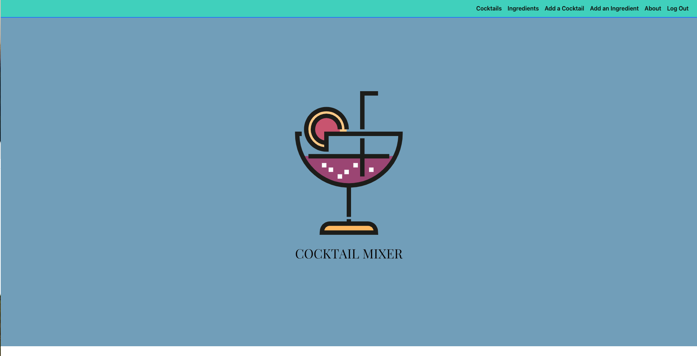

# Cocktail Mixer

This repository contains the MVT code for **Cocktail Mixer**, a Python, Django, PostgreSQL app using DTL templating that helps users create and share cocktail recipes. It offers a simple way to store and update recipes.

## Overview
* This app runs on an Django API for back-end handling and utilizes DTL tempalting for front-end display.
* It includes basic authorization, inherent to Django systems, for access to recipes.
* Signed-in users can navigate:
    * Cocktail pages: Users can add (`CREATE`), view (`READ`), edit (`UPDATE`), and remove (`DELETE`) cocktails. All cocktails created are viewable by any signed in user.
        * Additionally, users can see the popularity of drinkings by putting in the servings delivered.
    * Ingredient pages: Users can add (`CREATE`), view (`READ`), edit (`UPDATE`), and remove (`DELETE`) any ingredient, as well as assign categorization for their use. All ingredients created are viewable by any signed in user.
* User data persists after sign-out.

## Attributions
* [Cocktail](https://www.svgrepo.com/svg/143361/cocktail) icon by [svgrepo](https://www.svgrepo.com/)
* [Cocktail](https://www.svgrepo.com/svg/44422/cocktail) icon by [svgrepo](https://www.svgrepo.com/)
* [Highball Glass](https://icons8.com/icon/KK8OJVY8gEDd/highball-glass) icon by [Icon8](https://icons8.com)
* [Wine Glass](https://icons8.com/icon/NSc8eTiyKWyu/wine-glass) icon by [Icons8](https://icons8.com)
* [Tequila Shot](https://icons8.com/icon/7p3K15oFWkR2/tequila-shot) icon by [Icons8](https://icons8.com)
* [Martini](https://icons8.com/icon/BOz59XBor3NB/martini) icon by [Icons8](https://icons8.com)
* [Coupe Glass](https://icons8.com/icon/EvmXFDjXdF7Q/coupe-glass) icon by [Icons8](https://icons8.com)
* [Rocks Glass](https://icons8.com/icon/DkcNmVUcFfyi/rocks-glass) icon by [Icons8](https://icons8.com)
* [Collins Glass](https://icons8.com/icon/irHs4xLjSENV/collins-glass) icon by [Icons8](https://icons8.com)
* [Bar Counter](https://icons8.com/icon/A2GwDc2cLdPD/bar-counter) icon by [Icons8](https://icons8.com)
* [Bar](https://icons8.com/icon/EEfdXKCYidPb/bar) icon by [Icons8](https://icons8.com)
* [Shaker](https://icons8.com/icon/svGuyocRyHrw/shaker) icon by [Icons8](https://icons8.com)
* [Stool](https://icons8.com/icon/vlUgUrgwnEEE/stool) icon by [Icons8](https://icons8.com)
* [Ice Bucket](https://icons8.com/icon/RPBMHDHME3ya/ice-bucket) icon by [Icons8](https://icons8.com)
* [Mint Leaf](https://icons8.com/icon/ZmEO0iBdihG3/mint-leaf) icon by [Icons8](https://icons8.com)
* [Soda](https://icons8.com/icon/wbzdK50I2qX8/soda) icon by [Icons8](https://icons8.com)
* [Liquor](https://icons8.com/icon/G8jEs3RQJIp4/liquor) icon by [Icons8](https://icons8.com)
* [Dark Chocolate Liqueur](https://icons8.com/icon/OLHvxjbmGE8e/dark-chocolate-liqueur) icon by [Icons8](https://icons8.com)
* [Salt Shaker](https://icons8.com/icon/p2LqeSyKyGtK/salt-shaker) icon by [Icons8](https://icons8.com)

## Built with:

## Level Up
Potential features to be added on:
* Giving ingredient proportions to each cocktail
